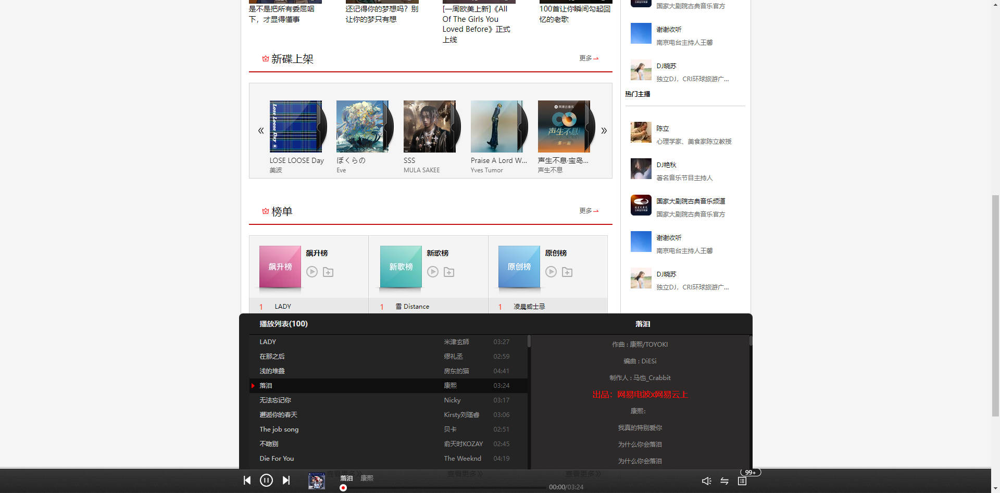

# React 实战之云音乐项目

> 如果觉得不错，或者对你有帮助，点一个 star~

1.1 项目简介
使用 React 编写的云音乐 PC Web 项目，接口来源于开源的接口。

项目已经完成功能如下：

- 轮播图
- 热门推荐
- 榜单
- 等等

歌曲播放：

- 目前做了榜单中歌曲的点击播放；
- 事实上其他页面只要将歌曲的 id 传入到 redux 中就可以，整个逻辑已经打通；
- 做了歌曲的各种控制（暂停、播放、上一首、下一首、进度改变）；
- 做了播放循序切换：顺序播放、随机播放、单曲循环；
- 做了歌词的解析、展示、滚动；

排行榜页面：

- 各种榜单的切换

歌单页面：

- 选择分类、选择分类后根据分类切换歌单；
- 根据分类，歌单列表的展示；
- 分页功能；

1.2. 项目规范

1.文件夹、文件名称统一小写、多个单词以连接符（-）连接；

2.TypeScript 变量名称采用小驼峰标识，常量全部使用大写字母，组件采用大驼峰；

3.CSS 采用普通 CSS 和 styled-component 结合来编写（全局采用普通 CSS、局部采用 styled-component）;

4.整个项目不再使用 class 组件，统一使用函数式组件，并且全面使用 Hooks；

5.所有的函数式组件，为了避免不必要的渲染，全部使用 memo 进行包裹；

1.3 完整项目体验地址：[小鱼音乐](http://112.124.28.77:3232)

> 该地址是很久之前使用 `js+react` 写的，并不是该项目
